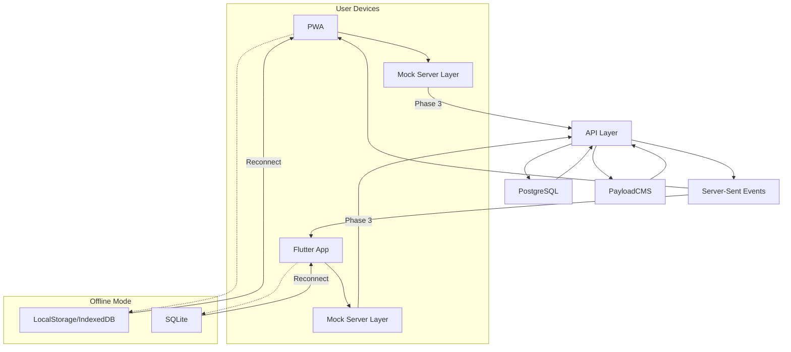

# System Architecture Design

## Overview

DICE is a cross-platform character management platform for Dungeons & Dragons 3.0e. It enables users to create, manage, and sync D&D characters with full support for the core ruleset, real-time calculations, and offline access. The system is designed with a modular frontend–backend separation, API-first architecture, and cloud-native infrastructure.

The initial architecture supports mocked-data development for fast iteration, with clear pathways to transition into full backend integration. The system must also support WCAG-compliant UI, PWA deployment, and eventual expansion to new D&D editions and features (e.g., inventory, spells, combat).

---

## Components Architecture

### 1. **Web Application (PWA)**

- **Technology**: Astro.js + React.js, TailwindCSS
- **Responsibilities**:
  - Character creation wizard and sheet UI
  - Offline mode via service workers + IndexedDB
  - PWA install capability
  - Uses mock data initially, then real GraphQL/tRPC API

### 2. **Mobile Application**

- **Technology**: Flutter
- **Responsibilities**:
  - Same UX as web
  - Local data persistence (SQLite)
  - Real-time character creation/editing
  - Sync with backend upon reconnect
  - Mock → API transition mirrors PWA flow

### 3. **API Layer**

- **Technology**: Nest.js with GraphQL and tRPC
- **Responsibilities**:
  - Provide typed API contracts for frontend
  - Handle authentication and authorisation
  - Interface with CMS and database
  - Publish Server-Sent Events for sync

### 4. **Data Layer (Database)**

- **Technology**: PostgreSQL (hosted on AWS RDS)
- **Responsibilities**:
  - Store character entities and user accounts
  - Store revision history or versioning metadata
  - Support search and filtering

### 5. **CMS**

- **Technology**: PayloadCMS
- **Responsibilities**:
  - Store and manage static rulebook data (e.g., races, classes, feats)
  - Editable via admin interface for future expansions

### 6. **Mock Server Layer**

- **Technology**: MirageJS (web), Local JSON Fixtures (Flutter)
- **Responsibilities**:
  - Simulate API behaviour for frontend development
  - Maintain parity with API schema
  - Easily replaceable when real backend is ready

### 7. **Infrastructure & DevOps**

- **Technology**: Kubernetes, Terraform, Docker, GitHub Actions
- **Responsibilities**:
  - Automate deployment
  - Manage environments (dev, staging, production)
  - Provide observability and scaling

---

## Data Flow

1. User accesses PWA/mobile app → data loaded from local storage (if offline).
2. On online mode, app fetches data from API or mocks.
3. Character creation wizard saves progress locally and/or pushes to backend.
4. Backend API validates input, persists to PostgreSQL, publishes sync events.
5. CMS data is accessed via static fetch or API integration for traits and rules.
6. Realtime updates pushed via SSE to clients (sync across tabs/devices).
7. Data is rehydrated and restored for offline usage upon reconnection.

---

## Stack

| Layer         | Technology                         |
| ------------- | ---------------------------------- |
| Web Frontend  | Astro.js, React.js, TailwindCSS    |
| Mobile        | Flutter                            |
| API Layer     | Nest.js, GraphQL, tRPC             |
| Database      | PostgreSQL (AWS RDS)               |
| CMS           | PayloadCMS                         |
| Local Storage | IndexedDB (web), SQLite (mobile)   |
| Sync          | Server-Sent Events                 |
| Mocking       | MirageJS, JSON Fixtures            |
| DevOps        | Docker, Kubernetes, Terraform      |
| Package Mgmt  | pnpm                               |
| Node Mgmt     | Volta                              |
| CI/CD         | GitHub Actions                     |
| Testing       | Vitest, Playwright, Flutter Driver |
| Accessibility | axe-core, Lighthouse CI            |

---

## Compliance

- **Accessibility**: WCAG 2.1 AA full compliance  
- **Data**: GDPR (data deletion, opt-out, user export)  
- **Security**: HTTPS everywhere, JWT/OAuth2, password hashing (bcrypt)  
- **PWA**: Compliant with Lighthouse PWA audits  
- **Offline**: IndexedDB and SQLite support required for offline CRUD

---

## Deployment Architecture

- **Environments**: Development → Staging → Production  
- **Infrastructure**:  
  - AWS (EU region)  
  - RDS for PostgreSQL  
  - ECS/EKS for container orchestration  
- **Builds**:  
  - Frontend (web): built via Astro + Vite  
  - Mobile: Flutter CI pipeline (Testflight + Play Console)  
- **CMS**: Self-hosted PayloadCMS, deployed via container  
- **Mock API**: Embedded in frontend builds during Phases 1–2  
- **DNS/SSL**: Cloudflare for TLS, caching, and CDN

---

## Error Handling Strategy

- Client-side:
  - Graceful degradation if API is unavailable
  - Global error boundaries (React + Flutter)
  - Local retry queue for offline updates

- Server-side:
  - Structured API error responses (GraphQL error codes)
  - Retry logic for transient DB/network issues
  - Audit logs for failures

- Sync strategy:
  - Last-write-wins conflict resolution
  - Optional character version diff viewer (future)

---

## Monitoring Strategy

- **Frontend**:  
  - Lighthouse CI (PWA, accessibility)  
  - Sentry (error logging + replay)  
  - Google Analytics / Plausible (usage)

- **Backend**:  
  - Prometheus + Grafana for service metrics  
  - Datadog or AWS CloudWatch for logs/alerts  
  - Uptime checks via Pingdom or StatusCake

- **Mobile**:  
  - Firebase Crashlytics  
  - Custom in-app telemetry for flow success/failure

---

## Performance Considerations

- **PWA**:
  - Code splitting via Astro islands  
  - Pre-cache with Workbox (service worker)  
  - IndexedDB for character state

- **Mobile**:
  - Lazy loading and tree shaking for packages  
  - Optimise rebuild regions via `const` and `shouldRebuild` in Flutter

- **API**:
  - Connection pooling for PostgreSQL  
  - Caching CMS content via Redis or in-memory  
  - Batching GraphQL queries

---

## Implementation Phases

| Phase   | Goal                                   | Timeline |
| ------- | -------------------------------------- | -------- |
| Phase 1 | PWA MVP with Mocked Server             | Aug 20   |
| Phase 2 | Flutter App with Mocked Server         | Sep 5    |
| Phase 3 | API Development (Nest + PostgreSQL)    | Sep 20   |
| Phase 4 | Integrate PWA and Mobile with Real API | Oct 5    |
| GA      | Full Unmocked System Launch            | Oct 25   |

---

## References

- [PRD](./product-requirements-document.md)  
- [UX Wireframes](./ux_wireframes.md)  
- [Functional Specs](./functional-specs.md)  
- [Project Structure](./project-structure.md)  
- [Accessibility QA Checklist](./a11y-checklist.md)
