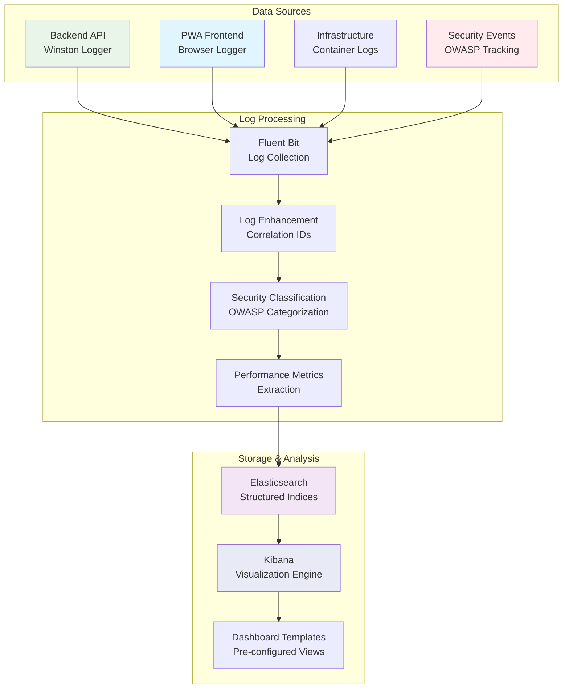

# DICE Kibana Dashboards Implementation Plan

**Version**: 1.0 - Initial Implementation  
**Created**: 2025-07-29 23:45 BST  
**Status**: 🚧 **PLANNING** - Ready for implementation  
**Architecture**: Centralised observability with structured logging data

---

## 🎯 **EXECUTIVE SUMMARY**

The DICE Kibana Dashboards Implementation Plan provides comprehensive observability across the entire distributed architecture. Our approach leverages the existing ELK stack infrastructure with structured JSON logging from backend services, PWA browser interactions, and infrastructure components.

### **Key Objectives**

- ✅ **Security Monitoring**: Real-time threat detection and OWASP compliance tracking
- ✅ **Performance Analytics**: API response times, error rates, and service health
- ✅ **User Experience**: Frontend interaction patterns and error tracking
- ✅ **Operational Intelligence**: Cross-service correlation and capacity planning
- ✅ **Development Insights**: Workflow metrics and deployment tracking

---

## 🏗️ **DASHBOARD ARCHITECTURE**

### **📊 Data Sources & Indices**

| **Dashboard**            | **Primary Data Source**         | **Index Pattern**           | **Key Metrics**                  |
| ------------------------ | ------------------------------- | --------------------------- | -------------------------------- |
| **Security Monitoring**  | Backend API + Security Events   | `dice-security-*`           | Auth events, OWASP categories    |
| **API Performance**      | Backend API + Performance Logs  | `dice-performance-*`        | Response times, error rates      |
| **Service Health**       | Infrastructure + Container Logs | `dice-logs-*`               | Container status, resource usage |
| **User Activity**        | PWA Browser Logger              | `dice-logs-*` (service:pwa) | User interactions, navigation    |
| **Operational Overview** | All Services + Correlation IDs  | `dice-logs-*`               | Cross-service tracing, trends    |

### **🔄 Data Flow Pipeline**



---

## 📋 **DASHBOARD SPECIFICATIONS**

### **🛡️ 1. Security Monitoring Dashboard**

**Priority**: HIGH  
**Purpose**: Real-time security threat detection and compliance monitoring

#### **Key Visualizations**

| **Visualization**                  | **Data Source**   | **Purpose**                       | **Alert Threshold**          |
| ---------------------------------- | ----------------- | --------------------------------- | ---------------------------- |
| **Authentication Events Timeline** | `dice-security-*` | Track login attempts and failures | >5 failed logins/minute/IP   |
| **OWASP Top 10 Distribution**      | `dice-security-*` | Security event categorization     | Any A01-A10 event detected   |
| **IP Threat Analysis**             | `dice-security-*` | Suspicious IP activity patterns   | >10 requests/minute/IP       |
| **User Session Anomalies**         | `dice-security-*` | Unusual user behaviour detection  | Session duration <30s or >8h |
| **Security Audit Trail**           | `dice-security-*` | Complete security event timeline  | All events logged            |

#### **Implementation Steps**

1. **Create Security Index Pattern**
   ```bash
   # Configure index pattern for security events
   curl -X PUT "localhost:9200/_index_template/dice-security-template" \
     -H 'Content-Type: application/json' \
     -d '{
       "index_patterns": ["dice-security-*"],
       "template": {
         "mappings": {
           "properties": {
             "owaspCategory": {"type": "keyword"},
             "securityEvent": {"type": "object"},
             "ip": {"type": "ip"},
             "userId": {"type": "keyword"}
           }
         }
       }
     }'
   ```

2. **Configure Security Visualizations**
   - Authentication success/failure rate over time
   - OWASP category distribution pie chart
   - IP address heatmap for threat analysis
   - User session duration histogram
   - Security event timeline with correlation IDs

3. **Set Up Security Alerts**
   - Failed authentication rate alerts
   - OWASP security event notifications
   - Suspicious IP activity alerts
   - User session anomaly detection

### **⚡ 2. API Performance Dashboard**

**Priority**: HIGH  
**Purpose**: Monitor API performance, error rates, and service health

#### **Key Visualizations**

| **Visualization**              | **Data Source**      | **Purpose**                    | **Alert Threshold**         |
| ------------------------------ | -------------------- | ------------------------------ | --------------------------- |
| **Response Time Percentiles**  | `dice-performance-*` | P50, P95, P99 response times   | P95 > 2s for any endpoint   |
| **Error Rate by Endpoint**     | `dice-performance-*` | Status code distribution       | Error rate > 5% for 5 min   |
| **Request Volume Trends**      | `dice-performance-*` | API usage patterns             | Volume spike >200% baseline |
| **Database Query Performance** | `dice-performance-*` | Slow query identification      | Query duration > 1s         |
| **Service Health Indicators**  | `dice-logs-*`        | Uptime and health check status | Health check failure        |

#### **Implementation Steps**

1. **Create Performance Index Pattern**
   ```bash
   # Configure index pattern for performance metrics
   curl -X PUT "localhost:9200/_index_template/dice-performance-template" \
     -H 'Content-Type: application/json' \
     -d '{
       "index_patterns": ["dice-performance-*"],
       "template": {
         "mappings": {
           "properties": {
             "duration": {"type": "long"},
             "statusCode": {"type": "integer"},
             "endpoint": {"type": "keyword"},
             "method": {"type": "keyword"}
           }
         }
       }
     }'
   ```

2. **Configure Performance Visualizations**
   - Response time percentile line charts
   - Error rate stacked bar charts
   - Request volume area charts
   - Database query performance tables
   - Service health status indicators

3. **Set Up Performance Alerts**
   - High response time alerts
   - Error rate threshold notifications
   - Service health check failures
   - Database performance degradation

### **🏥 3. Service Health Dashboard**

**Priority**: MEDIUM  
**Purpose**: Monitor infrastructure health and resource utilization

#### **Key Visualizations**

| **Visualization**                 | **Data Source** | **Purpose**                        | **Alert Threshold**          |
| --------------------------------- | --------------- | ---------------------------------- | ---------------------------- |
| **Container Status Overview**     | `dice-logs-*`   | Docker container health status     | Container not running        |
| **ELK Stack Health**              | `dice-logs-*`   | Elasticsearch, Kibana, Fluent Bit  | Service health check failure |
| **Resource Usage Trends**         | `dice-logs-*`   | CPU, memory, disk usage patterns   | Resource usage > 80%         |
| **Log Ingestion Rates**           | `dice-logs-*`   | Log pipeline performance           | Ingestion rate drop >50%     |
| **Infrastructure Service Status** | `dice-logs-*`   | PostgreSQL, Redis, Temporal health | Service unavailable          |

#### **Implementation Steps**

1. **Configure Service Health Monitoring**
   ```bash
   # Set up health check data collection
   curl -X PUT "localhost:9200/_index_template/dice-health-template" \
     -H 'Content-Type: application/json' \
     -d '{
       "index_patterns": ["dice-health-*"],
       "template": {
         "mappings": {
           "properties": {
             "service": {"type": "keyword"},
             "status": {"type": "keyword"},
             "healthScore": {"type": "float"},
             "resourceUsage": {"type": "object"}
           }
         }
       }
     }'
   ```

2. **Configure Health Visualizations**
   - Service status matrix with colour coding
   - Resource usage trend lines
   - Log ingestion rate gauges
   - Health score trend charts
   - Alert history timeline

3. **Set Up Health Alerts**
   - Container status change notifications
   - Resource usage threshold alerts
   - Service health degradation warnings
   - Log pipeline failure alerts

### **👥 4. User Activity Dashboard**

**Priority**: MEDIUM  
**Purpose**: Track user interactions and frontend performance

#### **Key Visualizations**

| **Visualization**             | **Data Source**             | **Purpose**                            | **Alert Threshold**          |
| ----------------------------- | --------------------------- | -------------------------------------- | ---------------------------- |
| **User Interaction Heatmap**  | `dice-logs-*` (service:pwa) | Click patterns and navigation          | No user activity for 1 hour  |
| **Error Tracking by Browser** | `dice-logs-*` (service:pwa) | Browser compatibility issues           | Error rate > 10% per browser |
| **Session Duration Analysis** | `dice-logs-*` (service:pwa) | User engagement metrics                | Session duration < 30s       |
| **Feature Usage Statistics**  | `dice-logs-*` (service:pwa) | Component and feature adoption         | Feature usage drop > 50%     |
| **Performance Metrics**       | `dice-logs-*` (service:pwa) | Page load times and interaction delays | Page load > 3s               |

#### **Implementation Steps**

1. **Configure User Activity Monitoring**
   ```bash
   # Set up PWA-specific index pattern
   curl -X PUT "localhost:9200/_index_template/dice-pwa-template" \
     -H 'Content-Type: application/json' \
     -d '{
       "index_patterns": ["dice-logs-*"],
       "template": {
         "mappings": {
           "properties": {
             "service": {"type": "keyword"},
             "component": {"type": "keyword"},
             "action": {"type": "keyword"},
             "userAgent": {"type": "text"},
             "sessionId": {"type": "keyword"}
           }
         }
       }
     }'
   ```

2. **Configure User Activity Visualizations**
   - User interaction heatmaps
   - Browser error distribution charts
   - Session duration histograms
   - Feature usage bar charts
   - Performance metric trend lines

3. **Set Up User Activity Alerts**
   - User engagement drop alerts
   - Browser compatibility warnings
   - Performance degradation notifications
   - Feature adoption monitoring

### **📊 5. Operational Overview Dashboard**

**Priority**: LOW  
**Purpose**: Cross-service correlation and system-wide trends

#### **Key Visualizations**

| **Visualization**                | **Data Source** | **Purpose**                           | **Alert Threshold**      |
| -------------------------------- | --------------- | ------------------------------------- | ------------------------ |
| **Cross-Service Correlation**    | `dice-logs-*`   | Request tracing across services       | Correlation ID missing   |
| **Log Volume Analysis**          | `dice-logs-*`   | Log volume by service and level       | Log volume spike > 300%  |
| **System Performance Trends**    | `dice-logs-*`   | Overall system performance metrics    | Performance degradation  |
| **Development Workflow Metrics** | `dice-logs-*`   | Deployment and development tracking   | Deployment failure       |
| **Capacity Planning Indicators** | `dice-logs-*`   | Resource usage trends and forecasting | Capacity threshold > 80% |

#### **Implementation Steps**

1. **Configure Operational Monitoring**
   ```bash
   # Set up correlation tracking
   curl -X PUT "localhost:9200/_index_template/dice-operational-template" \
     -H 'Content-Type: application/json' \
     -d '{
       "index_patterns": ["dice-logs-*"],
       "template": {
         "mappings": {
           "properties": {
             "correlationId": {"type": "keyword"},
             "service": {"type": "keyword"},
             "level": {"type": "keyword"},
             "tags": {"type": "keyword"}
           }
         }
       }
     }'
   ```

2. **Configure Operational Visualizations**
   - Service correlation flow diagrams
   - Log volume stacked area charts
   - Performance trend line charts
   - Capacity planning scatter plots
   - Development workflow timelines

3. **Set Up Operational Alerts**
   - Cross-service correlation failures
   - Log volume anomaly detection
   - System performance degradation
   - Capacity planning warnings

---

## 🚀 **IMPLEMENTATION ROADMAP**

### **Phase 1: Foundation Setup** *(Week 1)*

- [ ] **Elasticsearch Index Templates**
  - [ ] Create security event index template
  - [ ] Create performance metrics index template
  - [ ] Create health monitoring index template
  - [ ] Create PWA user activity index template

- [ ] **Kibana Configuration**
  - [ ] Set up index patterns for all data sources
  - [ ] Configure field mappings and data types
  - [ ] Create saved searches for common queries
  - [ ] Set up Kibana spaces for dashboard organisation

### **Phase 2: Core Dashboards** *(Week 2)*

- [ ] **Security Monitoring Dashboard**
  - [ ] Implement authentication event tracking
  - [ ] Create OWASP categorization visualizations
  - [ ] Set up real-time threat detection
  - [ ] Configure security alerts and notifications

- [ ] **API Performance Dashboard**
  - [ ] Implement response time monitoring
  - [ ] Create error rate visualizations
  - [ ] Set up performance alerts
  - [ ] Configure database query monitoring

### **Phase 3: Extended Monitoring** *(Week 3)*

- [ ] **Service Health Dashboard**
  - [ ] Implement container status monitoring
  - [ ] Create ELK stack health indicators
  - [ ] Set up resource usage tracking
  - [ ] Configure infrastructure alerts

- [ ] **User Activity Dashboard**
  - [ ] Implement user interaction tracking
  - [ ] Create browser error analysis
  - [ ] Set up session duration monitoring
  - [ ] Configure feature usage tracking

### **Phase 4: Advanced Analytics** *(Week 4)*

- [ ] **Operational Overview Dashboard**
  - [ ] Implement cross-service correlation
  - [ ] Create system-wide trend analysis
  - [ ] Set up capacity planning indicators
  - [ ] Configure development workflow tracking

- [ ] **Dashboard Integration & Testing**
  - [ ] Test all dashboard functionality
  - [ ] Validate alert configurations
  - [ ] Performance test dashboard queries
  - [ ] Create dashboard documentation

---

## 🔧 **TECHNICAL SPECIFICATIONS**

### **Data Schema Requirements**

#### **Security Events Schema**
```json
{
  "timestamp": "2025-07-29T23:45:00.000Z",
  "level": "warn",
  "service": "backend-api",
  "correlationId": "uuid-v4",
  "sessionId": "session-uuid",
  "userId": "user-id",
  "component": "SecurityInterceptor",
  "action": "authentication.failure",
  "message": "Failed login attempt",
  "metadata": {
    "ip": "192.168.1.100",
    "userAgent": "Mozilla/5.0...",
    "attemptCount": 3,
    "reason": "invalid_credentials"
  },
  "tags": ["security", "authentication", "failure"],
  "securityEvent": {
    "type": "authentication_failure",
    "severity": "medium",
    "source": "login_endpoint"
  },
  "owaspCategory": "A07"
}
```

#### **Performance Metrics Schema**
```json
{
  "timestamp": "2025-07-29T23:45:00.000Z",
  "level": "info",
  "service": "backend-api",
  "correlationId": "uuid-v4",
  "component": "AuthController",
  "action": "login",
  "message": "API request completed",
  "metadata": {
    "duration": 1250,
    "statusCode": 200,
    "endpoint": "/api/auth/login",
    "method": "POST",
    "requestSize": 1024,
    "responseSize": 2048
  },
  "tags": ["performance", "api", "auth"]
}
```

#### **User Activity Schema**
```json
{
  "timestamp": "2025-07-29T23:45:00.000Z",
  "level": "info",
  "service": "pwa-frontend",
  "correlationId": "uuid-v4",
  "sessionId": "session-uuid",
  "userId": "anonymous",
  "component": "UserInteraction",
  "action": "handleClick",
  "message": "User clicked on button",
  "metadata": {
    "element": {
      "tagName": "BUTTON",
      "id": "login-button",
      "className": "btn-primary"
    },
    "position": {
      "x": 150,
      "y": 200
    }
  },
  "tags": ["pwa", "interaction", "click"]
}
```

### **Alert Configuration**

#### **Security Alerts**
```yaml
# Authentication failure alert
alert:
  name: "High Authentication Failure Rate"
  condition: "count(level:error AND action:authentication.failure) > 5 per minute"
  action: "notify_security_team"
  severity: "high"

# OWASP security event alert
alert:
  name: "OWASP Security Event Detected"
  condition: "exists(owaspCategory)"
  action: "log_security_event"
  severity: "medium"
```

#### **Performance Alerts**
```yaml
# High response time alert
alert:
  name: "High API Response Time"
  condition: "percentile(metadata.duration, 95) > 2000"
  action: "notify_devops_team"
  severity: "medium"

# Error rate alert
alert:
  name: "High Error Rate"
  condition: "rate(level:error) > 0.05 for 5 minutes"
  action: "notify_devops_team"
  severity: "high"
```

---

## 📊 **SUCCESS METRICS**

### **Implementation Success Criteria**

- [ ] **Dashboard Availability**: All 5 dashboards operational and accessible
- [ ] **Data Accuracy**: Log data correctly categorized and visualized
- [ ] **Alert Functionality**: Real-time alerts working for all critical events
- [ ] **Performance**: Dashboard queries complete within 5 seconds
- [ ] **Coverage**: 100% of services and components monitored

### **Operational Success Criteria**

- [ ] **Security Monitoring**: Real-time threat detection with <5 minute response
- [ ] **Performance Tracking**: API performance issues detected within 2 minutes
- [ ] **User Experience**: Frontend issues identified within 10 minutes
- [ ] **System Health**: Infrastructure issues detected within 1 minute
- [ ] **Operational Intelligence**: Cross-service correlation working correctly

### **Business Value Metrics**

- [ ] **Mean Time to Detection (MTTD)**: <5 minutes for critical issues
- [ ] **Mean Time to Resolution (MTTR)**: <30 minutes for high-priority issues
- [ ] **System Uptime**: >99.9% availability with proactive monitoring
- [ ] **Security Compliance**: 100% OWASP Top 10 coverage
- [ ] **User Satisfaction**: Improved user experience through proactive monitoring

---

## 🚨 **RISK MITIGATION**

### **Technical Risks**

| **Risk**                  | **Impact** | **Mitigation Strategy**              |
| ------------------------- | ---------- | ------------------------------------ |
| **High Log Volume**       | Medium     | Implement log rotation and retention |
| **Dashboard Performance** | High       | Optimize queries and use caching     |
| **Data Accuracy**         | High       | Validate data pipeline and schemas   |
| **Alert Fatigue**         | Medium     | Tune alert thresholds and grouping   |
| **Storage Costs**         | Low        | Implement data lifecycle policies    |

### **Operational Risks**

| **Risk**                    | **Impact** | **Mitigation Strategy**             |
| --------------------------- | ---------- | ----------------------------------- |
| **Team Training**           | Medium     | Provide comprehensive documentation |
| **Alert Response**          | High       | Define clear escalation procedures  |
| **Dashboard Maintenance**   | Low        | Automate dashboard updates          |
| **Data Privacy**            | High       | Implement data sanitization         |
| **Compliance Requirements** | Medium     | Ensure GDPR and security compliance |

---

## 📝 **NEXT STEPS**

### **Immediate Actions** *(This Week)*

1. **Review and Approve Plan**
   - [ ] Validate dashboard specifications with stakeholders
   - [ ] Confirm data schema requirements
   - [ ] Review alert threshold configurations
   - [ ] Approve implementation timeline

2. **Prepare Infrastructure**
   - [ ] Verify ELK stack is running and healthy
   - [ ] Test log ingestion pipeline
   - [ ] Validate index patterns and mappings
   - [ ] Set up development environment

3. **Begin Implementation**
   - [ ] Start with Security Monitoring Dashboard
   - [ ] Create Elasticsearch index templates
   - [ ] Implement basic visualizations
   - [ ] Set up initial alert configurations

### **Success Criteria**

- [ ] **Week 1**: Foundation setup complete with index templates
- [ ] **Week 2**: Security and Performance dashboards operational
- [ ] **Week 3**: Service Health and User Activity dashboards complete
- [ ] **Week 4**: Operational Overview dashboard and full integration

---

**Document Status**: ✅ **READY FOR IMPLEMENTATION**  
**Next Review**: 2025-08-05  
**Owner**: Infrastructure Team  
**Stakeholders**: DevOps, Security, Development Teams
