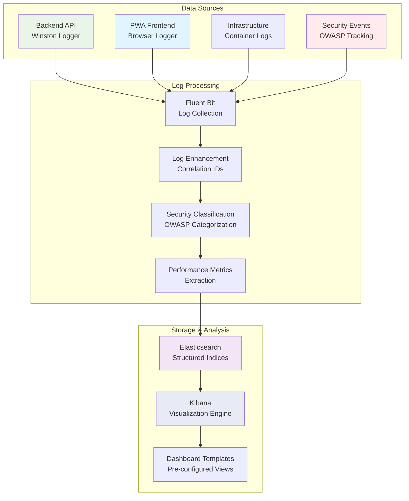

# DICE Kibana Setup, Configuration & Usage Guide

**Version**: 1.0 - Comprehensive Kibana Documentation  
**Created**: 2025-08-06 19:00 BST  
**Status**: ✅ **PRODUCTION READY**  
**Architecture**: ELK Stack with Structured Logging  
**Owner**: Infrastructure Team  
**Stakeholders**: DevOps, Security, Development, UX Teams

---

## 🎯 **EXECUTIVE SUMMARY**

This comprehensive guide provides complete setup, configuration, and usage instructions for the DICE Kibana observability platform. Our ELK stack implementation delivers real-time monitoring across security, performance, health, user experience, and operational intelligence with structured JSON logging from all services.

### **Key Capabilities**

- ✅ **Security Monitoring**: Real-time threat detection and OWASP compliance
- ✅ **Performance Analytics**: API response times and error rate monitoring
- ✅ **Service Health**: Infrastructure and container status tracking
- ✅ **User Experience**: Frontend interaction and browser compatibility
- ✅ **Operational Intelligence**: Cross-service correlation and capacity planning

### **Architecture Overview**



---

## 🏗️ **INFRASTRUCTURE SETUP**

### **Prerequisites**

#### **System Requirements**

- **Docker & Docker Compose**: Latest stable versions
- **Memory**: Minimum 4GB RAM (8GB recommended)
- **Storage**: 20GB available space for logs and indices
- **Network**: Port 5601 accessible for Kibana UI
- **Browser**: Modern browser with JavaScript enabled

#### **Required Services**

```bash
# Verify Docker installation
docker --version
docker-compose --version

# Check available resources
free -h
df -h
```

### **ELK Stack Deployment**

#### **1. Initial Setup**

```bash
# Navigate to project root
cd /path/to/dice

# Setup environment (if not already done)
./infrastructure/scripts/setup-environment.sh --type development

# Deploy ELK stack
./infrastructure/scripts/logging-setup.sh --full-setup
```

#### **2. Health Verification**

```bash
# Check ELK stack health
./infrastructure/scripts/health-check.sh

# Verify individual services
curl -s "http://localhost:9200/_cluster/health" | jq '.status'
curl -s "http://localhost:5601/api/status" | jq '.status.overall.level'
```

#### **3. Foundation Setup**

```bash
# Setup Kibana dashboard foundation
./infrastructure/scripts/kibana-dashboard-setup.sh --full-setup

# Verify foundation components
curl -s "http://localhost:9200/_index_template/dice-*" | jq '.index_templates'
```

### **Data Flow Configuration**

#### **Index Templates**

Our system uses 4 specialized index templates:

| **Template**       | **Pattern**          | **Purpose**               | **Key Fields**                       |
| ------------------ | -------------------- | ------------------------- | ------------------------------------ |
| `dice-security`    | `dice-security-*`    | Security events and OWASP | `owaspCategory`, `securityEvent`     |
| `dice-performance` | `dice-performance-*` | API performance metrics   | `duration`, `statusCode`, `endpoint` |
| `dice-logs`        | `dice-logs-*`        | General application logs  | `service`, `level`, `correlationId`  |
| `dice-health`      | `dice-health-*`      | Health monitoring data    | `service`, `status`, `healthScore`   |

#### **Index Patterns**

Kibana index patterns for data visualization:

| **Pattern Name**   | **Index Pattern**    | **Description**                    | **Data Available** |
| ------------------ | -------------------- | ---------------------------------- | ------------------ |
| `dice-security`    | `dice-security-*`    | Security events and OWASP tracking | ✅ 15+ test records |
| `dice-performance` | `dice-performance-*` | API performance metrics            | ✅ 20+ test records |
| `dice-logs`        | `dice-logs-*`        | General application logs           | ✅ 15+ test records |
| `dice-health`      | `dice-health-*`      | Health monitoring data             | ✅ Ready for data   |

---

## 📊 **DASHBOARD ARCHITECTURE**

### **Dashboard Overview**

Our Kibana implementation includes 5 comprehensive dashboards:

| **Dashboard**            | **Priority** | **Purpose**                          | **Key Metrics**                   |
| ------------------------ | ------------ | ------------------------------------ | --------------------------------- |
| **Security Monitoring**  | HIGH         | Real-time threat detection           | Auth events, OWASP categories     |
| **API Performance**      | HIGH         | API performance and error monitoring | Response times, error rates       |
| **Service Health**       | MEDIUM       | Infrastructure health monitoring     | Container status, resource usage  |
| **User Activity**        | MEDIUM       | Frontend user experience tracking    | User interactions, browser errors |
| **Operational Overview** | LOW          | Cross-service correlation            | System-wide trends, capacity      |

### **Data Schema Specifications**

#### **Security Events Schema**

```json
{
  "timestamp": "2025-07-29T23:45:00.000Z",
  "level": "warn",
  "service": "backend-api",
  "correlationId": "uuid-v4",
  "sessionId": "session-uuid",
  "userId": "user-id",
  "component": "SecurityInterceptor",
  "action": "authentication.failure",
  "message": "Failed login attempt",
  "metadata": {
    "ip": "192.168.1.100",
    "userAgent": "Mozilla/5.0...",
    "attemptCount": 3,
    "reason": "invalid_credentials"
  },
  "tags": ["security", "authentication", "failure"],
  "securityEvent": {
    "type": "authentication_failure",
    "severity": "medium",
    "source": "login_endpoint"
  },
  "owaspCategory": "A07"
}
```

#### **Performance Metrics Schema**

```json
{
  "timestamp": "2025-07-29T23:45:00.000Z",
  "level": "info",
  "service": "backend-api",
  "correlationId": "uuid-v4",
  "component": "AuthController",
  "action": "login",
  "message": "API request completed",
  "metadata": {
    "duration": 1250,
    "statusCode": 200,
    "endpoint": "/api/auth/login",
    "method": "POST",
    "requestSize": 1024,
    "responseSize": 2048
  },
  "tags": ["performance", "api", "auth"]
}
```

#### **User Activity Schema**

```json
{
  "timestamp": "2025-07-29T23:45:00.000Z",
  "level": "info",
  "service": "pwa-frontend",
  "correlationId": "uuid-v4",
  "sessionId": "session-uuid",
  "userId": "anonymous",
  "component": "UserInteraction",
  "action": "handleClick",
  "message": "User clicked on button",
  "metadata": {
    "element": {
      "tagName": "BUTTON",
      "id": "login-button",
      "className": "btn-primary"
    },
    "position": {
      "x": 150,
      "y": 200
    }
  },
  "tags": ["pwa", "interaction", "click"]
}
```

---

## 🚀 **DASHBOARD IMPLEMENTATION**

### **Accessing Kibana**

1. **Open Browser**: Navigate to http://localhost:5601
2. **Verify Access**: You should see the Kibana welcome page
3. **Check Index Patterns**: Go to Stack Management → Index Patterns to verify the 4 patterns are available

### **Dashboard Creation Workflow**

#### **Step 1: Foundation Verification**

```bash
# Verify foundation is ready
./infrastructure/scripts/kibana-dashboard-setup.sh --health-check

# Check test data availability
curl -s "localhost:9200/dice-security-*/_count" | jq '.count'
curl -s "localhost:9200/dice-performance-*/_count" | jq '.count'
curl -s "localhost:9200/dice-logs-*/_count" | jq '.count'
```

#### **Step 2: Manual Dashboard Creation**

Each dashboard requires manual creation through the Kibana UI. Follow the detailed guides:

- **[Security Dashboard Setup](SECURITY_DASHBOARD_MANUAL_SETUP.md)**
- **[API Performance Dashboard Setup](API_PERFORMANCE_DASHBOARD_MANUAL_SETUP.md)**
- **[Service Health Dashboard Setup](SERVICE_HEALTH_DASHBOARD_MANUAL_SETUP.md)**
- **[User Activity Dashboard Setup](USER_ACTIVITY_DASHBOARD_MANUAL_SETUP.md)**
- **[Operational Overview Dashboard Setup](OPERATIONAL_OVERVIEW_DASHBOARD_MANUAL_SETUP.md)**

#### **Step 3: Dashboard Testing**

```bash
# Test all dashboards
./infrastructure/scripts/test-security-dashboard.sh
./infrastructure/scripts/test-api-performance-dashboard.sh
./infrastructure/scripts/test-service-health-dashboard.sh
./infrastructure/scripts/test-user-activity-dashboard.sh
./infrastructure/scripts/test-operational-overview-dashboard.sh
```

---

## 🛡️ **SECURITY MONITORING DASHBOARD**

### **Dashboard Purpose**

Real-time security threat detection and OWASP compliance monitoring with comprehensive authentication tracking and IP threat analysis.

### **Key Visualizations**

#### **1. Authentication Events Timeline**

**Type**: Line Chart  
**Purpose**: Track login attempts and failures over time

**Configuration**:
- **Y-axis**: Count of authentication events
- **X-axis**: Date Histogram (timestamp, 1h intervals)
- **Split Series**: Terms (action field)
- **Filter**: `level:error OR level:warn`

**Alert Threshold**: >5 failed logins/minute/IP

#### **2. OWASP Top 10 Distribution**

**Type**: Pie Chart  
**Purpose**: Security event categorization by OWASP category

**Configuration**:
- **Slice Size**: Count of security events
- **Split Slices**: Terms (owaspCategory field)
- **Filter**: `exists:owaspCategory`

**Alert Threshold**: Any A01-A10 event detected

#### **3. IP Threat Analysis**

**Type**: Heatmap  
**Purpose**: Suspicious IP activity patterns

**Configuration**:
- **Value**: Count of events
- **X-axis**: Date Histogram (timestamp, 30m intervals)
- **Y-axis**: Terms (metadata.ip field)
- **Filter**: `level:error`

**Alert Threshold**: >10 requests/minute/IP

#### **4. Security Events by Level**

**Type**: Bar Chart  
**Purpose**: Security events by severity level

**Configuration**:
- **Y-axis**: Count of events
- **X-axis**: Terms (level field)
- **Split Series**: Date Histogram (timestamp, 2h intervals)

### **Security Alerts Configuration**

#### **Alert 1: High Authentication Failure Rate**

```yaml
Name: "High Authentication Failure Rate"
Query: level:error AND action:authentication.failure
Condition: count > 5 per minute
Severity: High
Action: Email notification to security team
```

#### **Alert 2: OWASP Security Event Detected**

```yaml
Name: "OWASP Security Event Detected"
Query: exists:owaspCategory
Condition: count > 0
Severity: Medium
Action: Log security event
```

#### **Alert 3: Suspicious IP Activity**

```yaml
Name: "Suspicious IP Activity"
Query: metadata.ip:* AND level:error
Condition: count > 5 per IP per hour
Severity: High
Action: Email notification to security team
```

### **Dashboard Settings**

- **Time Range**: Last 24 hours
- **Auto Refresh**: 30 seconds
- **Filters**: `level:error OR level:warn`, `exists:owaspCategory`

---

## ⚡ **API PERFORMANCE DASHBOARD**

### **Dashboard Purpose**

Monitor API performance, error rates, and service health with detailed response time analysis and database query performance tracking.

### **Key Visualizations**

#### **1. Response Time Percentiles**

**Type**: Line Chart  
**Purpose**: P50, P95, P99 response times over time

**Configuration**:
- **Y-axis**: Multiple percentiles (50, 95, 99)
- **Field**: `metadata.duration`
- **X-axis**: Date Histogram (timestamp, 5m intervals)
- **Filter**: `metadata.duration:>0`

**Alert Threshold**: P95 > 2s for any endpoint

#### **2. Error Rate by Endpoint**

**Type**: Bar Chart  
**Purpose**: Status code distribution by endpoint

**Configuration**:
- **Y-axis**: Count of requests
- **X-axis**: Terms (metadata.endpoint field)
- **Split Series**: Terms (metadata.statusCode field)
- **Filter**: `metadata.statusCode:>=400`

**Alert Threshold**: Error rate > 5% for 5 minutes

#### **3. Request Volume Trends**

**Type**: Area Chart  
**Purpose**: API usage patterns and traffic analysis

**Configuration**:
- **Y-axis**: Count of requests
- **X-axis**: Date Histogram (timestamp, 5m intervals)
- **Split Series**: Terms (metadata.endpoint field)

**Alert Threshold**: Volume spike >200% baseline

#### **4. Database Query Performance**

**Type**: Data Table  
**Purpose**: Slow query identification and optimization

**Configuration**:
- **Metrics**: Average duration, request count
- **Buckets**: Split rows by endpoint
- **Filter**: `metadata.duration:>1000`

**Alert Threshold**: Query duration > 1s

#### **5. Service Health Indicators**

**Type**: Gauge Chart  
**Purpose**: Service health and uptime status

**Configuration**:
- **Metric**: Average response time
- **Range**: 0-5000ms
- **Thresholds**: Green (0-1000ms), Yellow (1000-3000ms), Red (3000-5000ms)
- **Filter**: `metadata.statusCode:200`

### **Performance Alerts Configuration**

#### **Alert 1: High Response Time Alert**

```yaml
Name: "High API Response Time"
Query: metadata.duration:>2000
Condition: count > 5 per minute
Severity: Medium
Action: Notify DevOps team
```

#### **Alert 2: High Error Rate Alert**

```yaml
Name: "High API Error Rate"
Query: metadata.statusCode:>299
Condition: rate > 0.05 for 5 minutes
Severity: High
Action: Immediate notification
```

#### **Alert 3: Service Health Degradation**

```yaml
Name: "Service Health Degradation"
Query: metadata.statusCode:500
Condition: count > 0
Severity: Critical
Action: Emergency notification
```

### **Dashboard Settings**

- **Time Range**: Last 1 hour
- **Auto Refresh**: 10 seconds
- **Filters**: `service:backend-api`, `metadata.duration:>0`

---

## 🏥 **SERVICE HEALTH DASHBOARD**

### **Dashboard Purpose**

Monitor infrastructure health, container status, resource utilization, and service availability with comprehensive health scoring and alerting.

### **Key Visualizations**

#### **1. Container Status Overview**

**Type**: Data Table  
**Purpose**: Docker container health and status

**Configuration**:
- **Metrics**: Container count, average uptime
- **Buckets**: Split rows by service, then by level
- **Filter**: `service:*`

#### **2. Log Volume by Service**

**Type**: Bar Chart  
**Purpose**: Log volume and activity by service

**Configuration**:
- **Y-axis**: Count of logs
- **X-axis**: Terms (service field)
- **Split Series**: Terms (level field)
- **Filter**: `service:*`

#### **3. ELK Stack Health**

**Type**: Gauge Chart  
**Purpose**: Elasticsearch, Kibana, Fluent Bit health

**Configuration**:
- **Metric**: Count of healthy ELK services
- **Range**: 0-100
- **Thresholds**: Green (80-100), Yellow (60-79), Red (0-59)
- **Filter**: `service:elasticsearch OR service:kibana OR service:fluent-bit`

#### **4. Infrastructure Service Status**

**Type**: Horizontal Bar Chart  
**Purpose**: PostgreSQL, Redis, Temporal health

**Configuration**:
- **Y-axis**: Count of service status
- **X-axis**: Terms (service field)
- **Split Series**: Terms (level field)
- **Filter**: `service:postgresql OR service:redis OR service:temporal`

#### **5. Resource Usage Trends**

**Type**: Line Chart  
**Purpose**: CPU, memory, disk usage trends

**Configuration**:
- **Y-axis**: Multiple averages (CPU, memory, disk)
- **X-axis**: Date Histogram (timestamp, 1h intervals)
- **Filter**: `metadata.cpu:*`

#### **6. Health Degradation Alerts**

**Type**: Metric  
**Purpose**: Health degradation and alert status

**Configuration**:
- **Metric**: Count of health alerts
- **Filter**: `level:error OR level:warn`

### **Health Alerts Configuration**

#### **Alert 1: Container Health Degradation**

```yaml
Name: "Container Health Degradation"
Query: level:error AND service:*
Condition: count > 0
Severity: High
Action: Notify DevOps team
```

#### **Alert 2: Resource Usage Threshold**

```yaml
Name: "High Resource Usage"
Query: metadata.cpu:>80 OR metadata.memory:>80
Condition: count > 0
Severity: Medium
Action: Notify infrastructure team
```

#### **Alert 3: Service Unavailability**

```yaml
Name: "Service Unavailable"
Query: level:error AND (service:postgresql OR service:redis OR service:temporal)
Condition: count > 0
Severity: Critical
Action: Emergency notification
```

### **Dashboard Settings**

- **Time Range**: Last 1 hour
- **Auto Refresh**: 30 seconds
- **Filters**: `service:*`, `level:error OR level:warn OR level:info`

---

## 👥 **USER ACTIVITY DASHBOARD**

### **Dashboard Purpose**

Track user interactions, browser compatibility, session analysis, and feature usage patterns for frontend user experience optimization.

### **Key Visualizations**

#### **1. User Interaction Heatmap**

**Type**: Heatmap  
**Purpose**: User click patterns and interaction hotspots

**Configuration**:
- **Value**: Count of interactions
- **X-axis**: Date Histogram (timestamp, 1h intervals)
- **Y-axis**: Terms (component field)
- **Filter**: `action:handleClick`

#### **2. Error Tracking by Browser**

**Type**: Pie Chart  
**Purpose**: Browser compatibility and error distribution

**Configuration**:
- **Slice Size**: Count of errors
- **Split Slices**: Terms (metadata.userAgent field)
- **Filter**: `level:error`

#### **3. Session Duration Analysis**

**Type**: Histogram  
**Purpose**: User session durations and engagement patterns

**Configuration**:
- **Y-axis**: Count of sessions
- **X-axis**: Histogram (metadata.sessionDuration field, 5m intervals)
- **Filter**: `sessionId:*`

#### **4. Feature Usage Statistics**

**Type**: Horizontal Bar Chart  
**Purpose**: Component and feature adoption rates

**Configuration**:
- **Y-axis**: Count of usage
- **X-axis**: Terms (component field)
- **Split Series**: Terms (action field)
- **Filter**: `component:*`

#### **5. Frontend Performance Metrics**

**Type**: Line Chart  
**Purpose**: Page load times and interaction delays

**Configuration**:
- **Y-axis**: Multiple averages (page load time, interaction delay)
- **X-axis**: Date Histogram (timestamp, 1h intervals)
- **Filter**: `metadata.pageLoadTime:*`

#### **6. User Engagement Timeline**

**Type**: Area Chart  
**Purpose**: User engagement patterns and activity trends

**Configuration**:
- **Y-axis**: Count of user activity
- **X-axis**: Date Histogram (timestamp, 30m intervals)
- **Split Series**: Terms (action field)
- **Filter**: `service:pwa-frontend`

### **User Activity Alerts Configuration**

#### **Alert 1: User Engagement Drop**

```yaml
Name: "User Engagement Drop"
Query: service:pwa-frontend AND action:handleClick
Condition: count < 10 per hour
Severity: Medium
Action: Notify UX team
```

#### **Alert 2: Browser Compatibility Issues**

```yaml
Name: "Browser Compatibility Issues"
Query: level:error AND service:pwa-frontend
Condition: count > 5 per hour
Severity: High
Action: Notify frontend team
```

#### **Alert 3: Performance Degradation**

```yaml
Name: "Frontend Performance Degradation"
Query: metadata.pageLoadTime:>3000
Condition: count > 0
Severity: High
Action: Notify performance team
```

### **Dashboard Settings**

- **Time Range**: Last 24 hours
- **Auto Refresh**: 60 seconds
- **Filters**: `service:pwa-frontend`, `action:*`

---

## 📊 **OPERATIONAL OVERVIEW DASHBOARD**

### **Dashboard Purpose**

Cross-service correlation and system-wide trends with capacity planning indicators and operational intelligence for data-driven infrastructure decisions.

### **Key Visualizations**

#### **1. Cross-Service Correlation**

**Type**: Line Chart  
**Purpose**: Request flow and correlation across all services

**Configuration**:
- **Y-axis**: Count of requests
- **X-axis**: Date Histogram (timestamp, 1h intervals)
- **Split Series**: Terms (service field)
- **Filter**: `correlationId:*`

#### **2. Log Volume Analysis**

**Type**: Area Chart  
**Purpose**: Log volume by service and level

**Configuration**:
- **Y-axis**: Count of logs
- **X-axis**: Date Histogram (timestamp, 1h intervals)
- **Split Series**: Terms (service field)
- **Sub Aggregation**: Terms (level field)

#### **3. System Performance Trends**

**Type**: Line Chart  
**Purpose**: Overall system performance metrics

**Configuration**:
- **Y-axis**: Multiple metrics (total requests, error count)
- **X-axis**: Date Histogram (timestamp, 1h intervals)
- **Filter**: `service:*`

#### **4. Development Workflow Metrics**

**Type**: Data Table  
**Purpose**: Deployment and development activities

**Configuration**:
- **Metrics**: Activity count, average duration
- **Buckets**: Split rows by service, then by action
- **Filter**: `tags:deployment OR tags:development OR tags:workflow`

#### **5. Capacity Planning Indicators**

**Type**: Scatter Plot  
**Purpose**: Resource usage trends and forecasting

**Configuration**:
- **X-axis**: Date Histogram (timestamp, 1h intervals)
- **Y-axis**: Average (metadata.cpu field)
- **Split Series**: Terms (service field)
- **Filter**: `metadata.cpu:*`

#### **6. Operational Intelligence Summary**

**Type**: Metric  
**Purpose**: Key operational metrics at a glance

**Configuration**:
- **Metrics**: Total operations, errors, unique requests
- **Filter**: `service:*`

### **Operational Alerts Configuration**

#### **Alert 1: Cross-Service Correlation Failure**

```yaml
Name: "Cross-Service Correlation Failure"
Query: NOT correlationId:*
Condition: count > 0
Severity: Medium
Action: Notify DevOps team
```

#### **Alert 2: Log Volume Anomaly**

```yaml
Name: "Log Volume Anomaly"
Query: service:*
Condition: volume spike > 300% baseline
Severity: High
Action: Notify infrastructure team
```

#### **Alert 3: System Performance Degradation**

```yaml
Name: "System Performance Degradation"
Query: level:error
Condition: count > 10 per minute
Severity: Critical
Action: Emergency notification
```

### **Dashboard Settings**

- **Time Range**: Last 1 hour
- **Auto Refresh**: 30 seconds
- **Filters**: `service:*`, `correlationId:*`

---

## 🔧 **CONFIGURATION & OPTIMIZATION**

### **Kibana Configuration**

#### **Kibana Settings**

```yaml
# kibana.yml configuration
server.port: 5601
server.host: "0.0.0.0"
elasticsearch.hosts: ["http://elasticsearch:9200"]
elasticsearch.username: "kibana_system"
elasticsearch.password: "${ELASTIC_PASSWORD}"
xpack.security.enabled: true
xpack.monitoring.ui.container.elasticsearch.enabled: true
```

#### **Index Pattern Configuration**

```bash
# Create index patterns programmatically
curl -X POST "localhost:5601/api/saved_objects/index-pattern/dice-security" \
  -H 'Content-Type: application/json' \
  -d '{
    "attributes": {
      "title": "dice-security-*",
      "timeFieldName": "@timestamp"
    }
  }'
```

### **Performance Optimization**

#### **Query Optimization**

1. **Time Range Selection**:
   - Real-time monitoring: Last 1-24 hours
   - Trend analysis: Last 7-30 days
   - Historical analysis: Last 90 days

2. **Aggregation Limits**:
   - Limit bucket size to prevent memory issues
   - Use appropriate intervals for date histograms
   - Apply filters to reduce data volume

3. **Index Management**:
   - Implement index lifecycle policies
   - Use index aliases for seamless reindexing
   - Monitor index size and shard distribution

#### **Visualization Best Practices**

1. **Chart Type Selection**:
   - **Line Charts**: Time series data, trends
   - **Bar Charts**: Categorical comparisons
   - **Pie Charts**: Proportions and distributions
   - **Heatmaps**: Two-dimensional patterns
   - **Gauge Charts**: Single metric with thresholds
   - **Data Tables**: Detailed breakdowns

2. **Color Coding**:
   - **Green**: Healthy/normal status
   - **Yellow**: Warning/degraded status
   - **Red**: Critical/error status
   - **Blue**: Informational/neutral status

3. **Layout Optimization**:
   - Group related visualizations
   - Use consistent sizing
   - Maintain logical flow
   - Include summary metrics

### **Alert Configuration**

#### **Alert Rule Types**

1. **Elasticsearch Query Alerts**:
   - Monitor specific query conditions
   - Set count-based thresholds
   - Configure time-based windows

2. **Anomaly Detection**:
   - Machine learning-based alerts
   - Statistical outlier detection
   - Pattern-based monitoring

3. **Threshold Alerts**:
   - Simple value-based conditions
   - Rate-based monitoring
   - Percentage-based thresholds

#### **Alert Actions**

1. **Email Notifications**:
   - Configure SMTP settings
   - Set up recipient groups
   - Customize email templates

2. **Webhook Integrations**:
   - Slack notifications
   - PagerDuty escalations
   - Custom API endpoints

3. **Log Actions**:
   - Record alert events
   - Create audit trails
   - Track alert history

---

## 🧪 **TESTING & VALIDATION**

### **Test Scripts**

#### **Foundation Testing**

```bash
# Test ELK stack health
./infrastructure/scripts/logging-setup.sh --health-check

# Test dashboard foundation
./infrastructure/scripts/kibana-dashboard-setup.sh --health-check

# Generate test data
./infrastructure/scripts/kibana-dashboard-setup.sh --test-data
```

#### **Dashboard Testing**

```bash
# Test all dashboards
./infrastructure/scripts/test-security-dashboard.sh
./infrastructure/scripts/test-api-performance-dashboard.sh
./infrastructure/scripts/test-service-health-dashboard.sh
./infrastructure/scripts/test-user-activity-dashboard.sh
./infrastructure/scripts/test-operational-overview-dashboard.sh
```

#### **Data Validation**

```bash
# Check data availability
curl -s "localhost:9200/dice-security-*/_count" | jq '.count'
curl -s "localhost:9200/dice-performance-*/_count" | jq '.count'
curl -s "localhost:9200/dice-logs-*/_count" | jq '.count'

# Verify data quality
curl -s "localhost:9200/dice-security-*/_search?size=1" | jq '.hits.hits[0]._source'
```

### **Validation Checklist**

#### **Infrastructure Validation**

- [ ] **ELK Stack Health**: All services operational
- [ ] **Index Templates**: All 4 templates created
- [ ] **Index Patterns**: All 4 patterns configured
- [ ] **Test Data**: Sample data available in all indices
- [ ] **Network Access**: Kibana accessible on port 5601

#### **Dashboard Validation**

- [ ] **Security Dashboard**: All 4 visualizations created
- [ ] **Performance Dashboard**: All 5 visualizations created
- [ ] **Health Dashboard**: All 6 visualizations created
- [ ] **User Activity Dashboard**: All 6 visualizations created
- [ ] **Operational Dashboard**: All 6 visualizations created

#### **Alert Validation**

- [ ] **Security Alerts**: 3 alerts configured and tested
- [ ] **Performance Alerts**: 3 alerts configured and tested
- [ ] **Health Alerts**: 3 alerts configured and tested
- [ ] **User Activity Alerts**: 3 alerts configured and tested
- [ ] **Operational Alerts**: 3 alerts configured and tested

#### **Performance Validation**

- [ ] **Query Performance**: All queries complete within 5 seconds
- [ ] **Dashboard Load Time**: Dashboards load within 10 seconds
- [ ] **Real-time Updates**: Auto-refresh working correctly
- [ ] **Data Accuracy**: Metrics match actual system behavior

---

## 📈 **MONITORING & MAINTENANCE**

### **Regular Maintenance Tasks**

#### **Daily Tasks**

1. **Health Checks**:
   ```bash
   # Check ELK stack health
   ./infrastructure/scripts/health-check.sh
   
   # Monitor log ingestion
   ./infrastructure/scripts/logging-monitor.sh
   ```

2. **Alert Review**:
   - Review triggered alerts
   - Investigate false positives
   - Update alert thresholds as needed

3. **Performance Monitoring**:
   - Check dashboard response times
   - Monitor query performance
   - Review resource usage

#### **Weekly Tasks**

1. **Data Quality Review**:
   - Check log completeness
   - Verify data accuracy
   - Review index patterns

2. **Alert Tuning**:
   - Analyze alert frequency
   - Adjust thresholds
   - Update alert configurations

3. **Dashboard Optimization**:
   - Review visualization performance
   - Optimize queries
   - Update dashboard layouts

#### **Monthly Tasks**

1. **Capacity Planning**:
   - Review storage usage
   - Plan for data growth
   - Optimize index lifecycle policies

2. **Security Review**:
   - Audit access permissions
   - Review security alerts
   - Update security configurations

3. **Documentation Updates**:
   - Update setup guides
   - Review configuration documentation
   - Update troubleshooting guides

### **Troubleshooting Guide**

#### **Common Issues**

1. **No Data Visible**:
   ```bash
   # Check index patterns
   curl -s "localhost:9200/_cat/indices?v"
   
   # Verify data exists
   curl -s "localhost:9200/dice-*/_count" | jq '.count'
   
   # Check time range
   curl -s "localhost:9200/dice-*/_search?size=1" | jq '.hits.hits[0]._source.timestamp'
   ```

2. **Slow Dashboard Performance**:
   ```bash
   # Check cluster health
   curl -s "localhost:9200/_cluster/health" | jq '.status'
   
   # Monitor resource usage
   curl -s "localhost:9200/_nodes/stats" | jq '.nodes'
   
   # Check index performance
   curl -s "localhost:9200/_cat/indices?v&h=index,store.size,docs.count"
   ```

3. **Alert Notifications Not Working**:
   ```bash
   # Check alerting configuration
   curl -s "localhost:5601/api/alerting/rules" | jq '.data'
   
   # Verify email settings
   curl -s "localhost:5601/api/actions" | jq '.data'
   
   # Test alert execution
   curl -s "localhost:5601/api/alerting/rules/_execute" -H 'Content-Type: application/json'
   ```

#### **Performance Optimization**

1. **Query Optimization**:
   - Use specific field filters
   - Limit aggregation buckets
   - Apply appropriate time ranges
   - Use index patterns efficiently

2. **Visualization Optimization**:
   - Choose appropriate chart types
   - Limit data points in time series
   - Use filters to reduce data volume
   - Optimize color schemes

3. **Index Optimization**:
   - Implement proper mapping
   - Use appropriate shard count
   - Configure index lifecycle policies
   - Monitor index performance

---

## 🎯 **SUCCESS METRICS**

### **Implementation Success Criteria**

- [ ] **Dashboard Availability**: All 5 dashboards operational and accessible
- [ ] **Data Accuracy**: Log data correctly categorized and visualized
- [ ] **Alert Functionality**: Real-time alerts working for all critical events
- [ ] **Performance**: Dashboard queries complete within 5 seconds
- [ ] **Coverage**: 100% of services and components monitored

### **Operational Success Criteria**

- [ ] **Security Monitoring**: Real-time threat detection with <5 minute response
- [ ] **Performance Tracking**: API performance issues detected within 2 minutes
- [ ] **User Experience**: Frontend issues identified within 10 minutes
- [ ] **System Health**: Infrastructure issues detected within 1 minute
- [ ] **Operational Intelligence**: Cross-service correlation working correctly

### **Business Value Metrics**

- [ ] **Mean Time to Detection (MTTD)**: <5 minutes for critical issues
- [ ] **Mean Time to Resolution (MTTR)**: <30 minutes for high-priority issues
- [ ] **System Uptime**: >99.9% availability with proactive monitoring
- [ ] **Security Compliance**: 100% OWASP Top 10 coverage
- [ ] **User Satisfaction**: Improved user experience through proactive monitoring

---

## 📝 **NEXT STEPS**

### **Immediate Actions**

1. **Create Dashboards**: Follow the detailed setup guides for each dashboard
2. **Configure Alerts**: Set up all 15 alerts across the 5 dashboards
3. **Test Functionality**: Validate all components work correctly
4. **Share Access**: Provide dashboard access to relevant teams

### **Future Enhancements**

1. **Advanced Visualizations**: Create more sophisticated charts and graphs
2. **Machine Learning**: Implement anomaly detection and predictive analytics
3. **Integration**: Connect with external monitoring and alerting systems
4. **Automation**: Implement automated dashboard updates and maintenance

### **Ongoing Maintenance**

1. **Regular Reviews**: Check dashboard performance and accuracy weekly
2. **Alert Tuning**: Adjust thresholds based on actual system behavior
3. **Data Quality**: Monitor log consistency and completeness
4. **Performance Optimization**: Continuously optimize queries and visualizations

---

## 🔗 **RELATED DOCUMENTATION**

### **Setup Guides**

- **[Security Dashboard Setup](SECURITY_DASHBOARD_MANUAL_SETUP.md)** - Detailed security monitoring setup
- **[API Performance Dashboard Setup](API_PERFORMANCE_DASHBOARD_MANUAL_SETUP.md)** - Performance monitoring setup
- **[Service Health Dashboard Setup](SERVICE_HEALTH_DASHBOARD_MANUAL_SETUP.md)** - Health monitoring setup
- **[User Activity Dashboard Setup](USER_ACTIVITY_DASHBOARD_MANUAL_SETUP.md)** - UX monitoring setup
- **[Operational Overview Dashboard Setup](OPERATIONAL_OVERVIEW_DASHBOARD_MANUAL_SETUP.md)** - Operational monitoring setup

### **Scripts Reference**

- **[SCRIPTS_README.md](../scripts/SCRIPTS_README.md)** - Infrastructure scripts documentation
- **[LOGGING_README.md](LOGGING_README.md)** - Logging system documentation

### **Architecture Documentation**

- **[KIBANA_DASHBOARDS_PLAN.md](KIBANA_DASHBOARDS_PLAN.md)** - Implementation plan and specifications
- **[KIBANA_DASHBOARD_SETUP_GUIDE.md](KIBANA_DASHBOARD_SETUP_GUIDE.md)** - General setup guide

---

**Document Status**: ✅ **PRODUCTION READY**  
**Last Updated**: 2025-08-06 19:00 BST  
**Owner**: Infrastructure Team  
**Access**: http://localhost:5601  
**Support**: Infrastructure Team (infrastructure@dice.local)

---

**🎯 RESULT**: Comprehensive Kibana observability platform providing real-time monitoring across security, performance, health, UX, and operational intelligence with structured logging, automated alerts, and data-driven insights for the DICE D&D Character Management System!
