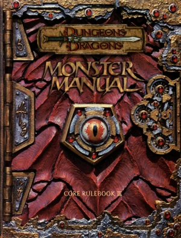

# Dungeons & Dragons 3.0 - Monster Manual

The Monster Manual, released in 2000, is one of the three core rulebooks for Dungeons & Dragons 3rd edition. It presents rules and game statistics for monsters, and is intended primarily for use by the Dungeon Master.
