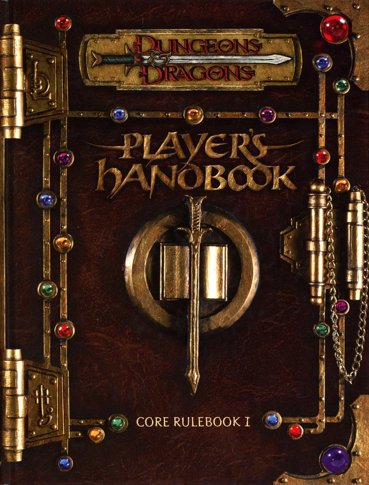

# Dungeons & Dragons 3.0 - Player's Handbook

The **Player's Handbook**, released in 2000, is one of three core rulebooks for Dungeons & Dragons 3rd edition.

The Player's Handbook describes the main rules necessary to play Dungeons & Dragons 3rd edition. Key contents of the book include rules for character creation, combat, and spells.

Character Creation Basics describes the order of making a player character. Ability scores are rolled as 4d6 drop lowest, by default.

## Summary of Character Creation

To create a level 1 character, follow the steps below. You will need a photocopy of the character sheet, a pencil, a few sheets of rough paper and four six-sided dice.

### O. Consult the Dungeon Master

As part of his campaign, your Dungeon Master (or DM) may apply certain rules that differ from those suggested here. If so, he should let you know. And don't hesitate to ask the other players what type of character they have chosen, so that you fit in well with the group.

### 1. Characteristic Values

Determine your character's six characteristic values.

For each, roll the four six-sided dice, ignoring the lowest number and adding the other three. Write down the six results on your rough draft.

If the characteristics are really too weak, redraw the dice. A character is considered unplayable if the sum of his characteristic modifiers (before choosing his race) is less than or equal to 0, or if none of his characteristics exceeds 13.

### 2. Class and Race

You need to select these two items at the same time, as most classes are particularly represented in certain races. Each class described in Chapter 3 deals briefly with the corresponding races. Refer to them for the most common combinations, then enter your class and race on the character sheet.

Think about how you want your adventurer to behave. You don't need to detail his personality so early on, but it's a good idea to start thinking about it.

The possible classes are: **barbarian**, **bard**, **cleric**, **druid**, **fighter**, **monk**, **paladin**, **ranger**, **rogue**, **sorcerer**, and **wizard**. As for the races, you can choose from: **dwarf**, **elf**, **gnome**, **half-elf**, **half-orc**, **halfling**, and **human**.

### 3. Assigning and modifying Characteristic Values

Now that you know your character's class and race, divide the six totals obtained in step 1 between your character's six characteristics: **Strength**, **Dexterity**, **Constitution**, **Intelligence**, **Wisdom** and **Charisma**. Modify these values as indicated in Table 2-1: Racial modifiers.

Assign the highest values to your character's major characteristics (these are detailed in the description of each class). Then allocate the remaining values according to the strengths and weaknesses you wish to give your character.

Note the modifier that accompanies each characteristic (you'll find it in Table 1-1: Characteristic modifiers and bonus spell). This indicates how your character compares to the average.

### 4. Study the character examples

Chapter 3 provides one or more character examples for each class. These examples are designed to help you refine the creation of your adventurer. If the gifts, skills and equipment listed suit you, you can make them your own and copy them onto your character sheet. You can also use them to make your own choices.

### 5. Note down Race and Class Abilities

Your character's race and class give them certain abilities that are automatically acquired. But some will require you to make choices, and probably skip several stages in the creation process. For example, if you want to take Exotic Weapon Handling as an additional ability for your warrior, you'd better know what exotic weapons are! Feel free to skip from one chapter to the next and go back if you need to.

## Ability Scores

An ability score is a numeric representation of one of a character or creature's physical or mental attributes.

Since the original Dungeons & Dragons rules, the six ability scores used in D&D have been strength, dexterity, constitution, intelligence, wisdom, and charisma. The standard order in which they are listed on the character sheet varies between editions of the rules.

Standardly, 4d6 drop lowest, and any character with ability score modifiers of +0 or less, or no ability score above a 13, may reroll completely. Defined in the Player's Handbook (3.0) (2000), p.7-8. Eight variants given in the Dungeon Master's Guide (3.0) (2000), p.19-20 and Dungeon Master's Guide (3.5) (2003), p.169-170 are available at DM's discretion. These are Standard Point Buy (start with each score at 8 and spend points based on a table where higher stats cost more points), Nonstandard Point Buy (same, but with more or less points); Elite Array (15, 14, 13, 12, 10, 8, arrange as desired); The Floating Reroll (4d6 drop lowest, rerolling the lowest die once only, arrange as desired); Organic Characters (4d6 drop lowest in order, reroll any one, switch any two); Customised Average Characters (3d6, arrange as desired, reroll if no score of 12 or higher or modifiers total -3 or lower); Random Average Characters (3d6 in order, reroll if no score of 12 or higher or modifiers total -3 or lower); and High-Powered Characters (5d6 six times, discard lowest two, arrange as desired, reroll if no score of 15 or higher or modifiers total below +2).

## Races

Races introduces the standard seven player character races: **dwarf**, **elf**, **gnome**, **half-elf**, **half-orc**, **halfling**, and **human**.

## Classes

Classes details the eleven standard character classes of third edition: **barbarian**, **bard**, **cleric**, **druid**, **fighter**, **monk**, **paladin**, **ranger**, **rogue**, **sorcerer**, and **wizard**.

## Skills

## Feats

## Description

### Aligment

Alignment is a rule in Dungeons & Dragons which describes a character or creature's moral and ethical outlook. A player character's alignment is freely chosen by the player, while the Dungeon Master determines the alignment of NPCs and monsters.

The rules for alignment vary considerably between editions of the game's rules. The roleplaying game community has long debated the exact definition of various alignments, and the concept of the alignment chart has entered the wider internet community.

In the original Dungeons & Dragons (1974), all characters and monsters are either **Lawful**, **Neutral**, or **Chaotic**. Advanced Dungeons & Dragons (1979) introduced a second axis, allowing characters and creatures to additionally be described as **Good**, **Neutral**, or **Evil**. These two axes have nine independent combinations. 

- **Lawful Good**: A lawful good character is a protector. The iconic example of lawful good is a paladin, a holy knight who protects the weak and destroys evil. The D&D 3.5 Player's Handbook, p.104-106, which provides nicknames for each of the nine alignments, refers to this alignment as "Crusader". 
- **Neutral Good**: A neutral good character believes in altruism over all else. The D&D 3.5 Player's Handbook nicknames this alignment "Benefactor".
- **Chaotic Good**: A chaotic good character believes in freedom as the highest virtue. The iconic example of chaotic good is Robin Hood, who rebels against authority as a way to protect the poor from poverty and suffering. The D&D 3.5 Player's Handbook nicknames this alignment "Rebel".
- **Lawful Neutral**: A lawful neutral character obeys principle as the highest virtue. For example, a judge who treats all fairly and equally would be considered lawful neutral. The D&D 3.5 Player's Handbook nicknames this alignment "Judge".
- **True Neutral**: A true neutral character is neutral on both axes, and cares not for any stance of alignment. This often describes someone who cares only for their own personal needs, neither inclined to hurt or harm others, nor to obey or rebel. A few true neutral characters rather follow an intentional philosophy of balance. One such example is Mordenkainen, an archmage on the world of Oerth, who uses his great power to maintain the status quo and prevent any one force from becoming too powerful. D&D creator Gary Gygax preferred this definition of true neutral. In Dungeons & Dragons 3rd edition and earlier, this category included unaligned animals, who have no sense of ethics beyond their own survival needs, and so cannot really be described as good or evil in human terms. In D&D 5th edition, animals are instead considered unaligned, a separate category for creatures which lack an alignment. True neutral is also referred to as "neutral" or rarely "neutral neutral". It is abbreviated N or TN. The D&D 3.5 Player's Handbook nicknames this alignment "Undecided".
- **Chaotic Neutral**: A chaotic neutral character follows their heart, but without the willingness to self-sacrifice as a chaotic good character might. A great many adventurers are chaotic neutral, doing what they wish and rejecting all forms of authority. Some chaotic neutral characters follow a deliberate philosophy of destroying the old to make way for the new. The D&D 3.5 Player's Handbook nicknames this alignment "Free Spirit".
- **Lawful Evil**: A lawful evil character is a tyrant. They have no moral qualms about punishing individuals for the greater goal of furthering society. A lawful evil villain is often easy to deal with, as they can often be trusted to keep their word. The D&D 3.5 Player's Handbook nicknames this alignment "Dominator".
- **Neutral Evil**: A neutral evil character is selfish, and has no problem harming others to get what they want - if they can get away with it. The D&D 3.5 Player's Handbook nicknames this alignment "Malefactor".
- **Chaotic Evil**: A chaotic evil character is malevolent. A villain bent on revenge might be of this alignment. Where the most powerful lawful evil villains might aim to conquer the world, this might be preferable to their chaotic evil counterparts, who would destroy it. The D&D 3.5 Player's Handbook nicknames this alignment "Destroyer".

A player character's alignment is not fixed. A player may change their alignment voluntarily. How easily this is done varies between rules: in AD&D 1st edition it is difficult, while in 2nd edition it can impose an experience penalty.

In rare cases, the DM may insist that a player who has acted outside of his stated alignment must change it, such as if a character claims to be lawful good but frequently commits theft and murder.

For the most part, alignment is merely a way of describing a character. However, certain things, usually magic, are affected by a character's alignment.

Spells and powers like detect evil are able to sense creatures of a certain alignment. Other spells, like protection from evil, protect against innately evil extraplanar creatures like demons, but have no effect against evil humans.

A small number of offensive spells, magical weapons, magic items, and special abilities of monsters are more harmful to creatures of a certain alignment.

Certain planes of existence have an innate alignment, and visitors of an opposing alignment may find themselves weakened while in such a world. In a similar manner, visitors to a kingdom whose alignment opposes their own may find themselves shunned by a society who disagrees with their ways and beliefs.

## Equipment

## Combat

## Adventuring

## Magic

## Spells

